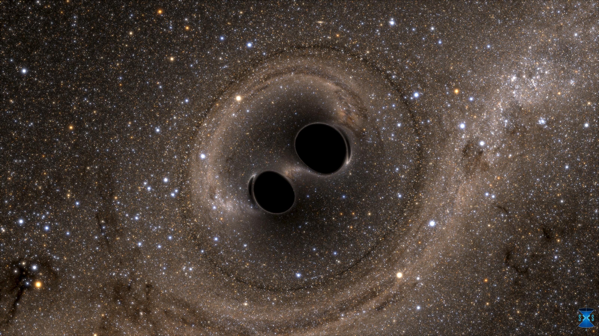

Humans have a strange relationship with reality. We’ve developed a large body of mathematical tools that *sometimes* seem to let us beat time. We can send spaceships out to [take photos of distant planets](https://www.nasa.gov/feature/40-years-ago-voyager-1-explores-jupiter), and be almost totally sure that they’ll make it. It takes minutes (seconds?) to simulate voyages of thousands of years. We can examine light from stars millions of light years away, and make good guesses about the stars’ ingredients.

Other times, our models are pitifully slow. Our [best tools for analyzing quantum mechanical systems](https://en.wikipedia.org/wiki/Quantum_simulator) slow down exponentially, the more particles we consider. A single human cell has [100 trillion atoms](https://www.thoughtco.com/how-many-atoms-in-human-cell-603882)! Simulating this is completely off the table. But a cell ticks along just fine. It doesn’t glitch out and slow down when it divides, and divides again, eventually splitting into the 30 trillion cells in the human body. Is the universe computing all of this? If we do [live in a simulation](https://en.wikipedia.org/wiki/Simulation_hypothesis), it’s impossibly more efficient than the best models we can make create today.

Sometimes we beat time, sometimes we fail. What exactly is it that’s running slow, or fast? Humans have developed a lot of mathematics that seems to [describe reality eerily well](https://www.dartmouth.edu/~matc/MathDrama/reading/Wigner.html), and we can write down *programs* that simulate our different guesses about reality. We run our guesses as programs. We look out at the world, put the observations into the computer, or the formula, roll the clock forward and check the program’s guesses against what we see outside. Does it match?

## **Computing the Universe**

The assumption baked in to this style of investigation is that the universe is computing itself, somehow, using a small set of rules that don’t change. We’ve decided that there’s no room for magic, or, say, *system upgrades* that we could notice, upgrades that change the behavior of the system from one year to the next. The speed of light doesn’t get modified when the burnt-out team maintaining our reality ships version 2.2 of the [Multiverse](https://en.wikipedia.org/wiki/Multiverse).

*Black holes merging, [from SXS, the Simulating eXtreme Spacetimes project](http://www.black-holes.org)*

And, somehow, magically, some of the matter that’s computing itself seems to have woken up. Humans, and almost certainly many more creatures, have developed goals and drives, and little internal models humming along, simulating the universe.

We can fly fake spaceships in our universe-model, and they get to the same place that real ones do when we launch them in the outside universe. Can we pull off the same trick with consciousness, with a mind? Can humans build a conscious program? Or is there some special ingredient in the outside universe that makes simulating consciousness on a [classical computer](https://plato.stanford.edu/entries/turing-machine/) impossible? The whole field of artificial intelligence is full of people working hard to figure this out.

This is all strange and confusing and insane, and beautiful. I feel so lucky to be alive in the era where we’re awake to the game, but haven’t figured it out yet. The physics of the universe, and the mystery of how matter woke up ([is it ](https://amzn.to/3ef76Lw)*[all](https://amzn.to/3ef76Lw)*[ awake?](https://amzn.to/3ef76Lw)) is the best game in town for the curious mind.

The swathes of mathematical tools we’ve invented to start trying to answer these questions are really like [alien technology](https://corecursive.com/050-sam-ritchie-portal-abstractions/), probably more powerful than we understand. Maybe it’s right that so many of us, myself included, are a little scared of learning to use them.

If you find all of this as bizarre and wonderful as I do, you need to start staring hard at whatever the hell is going on here. And that means [learning how to read math](https://roadtoreality.substack.com/), and deploying it in with style, to poke and prod at this humming vibrant thing, computing itself all around us.
