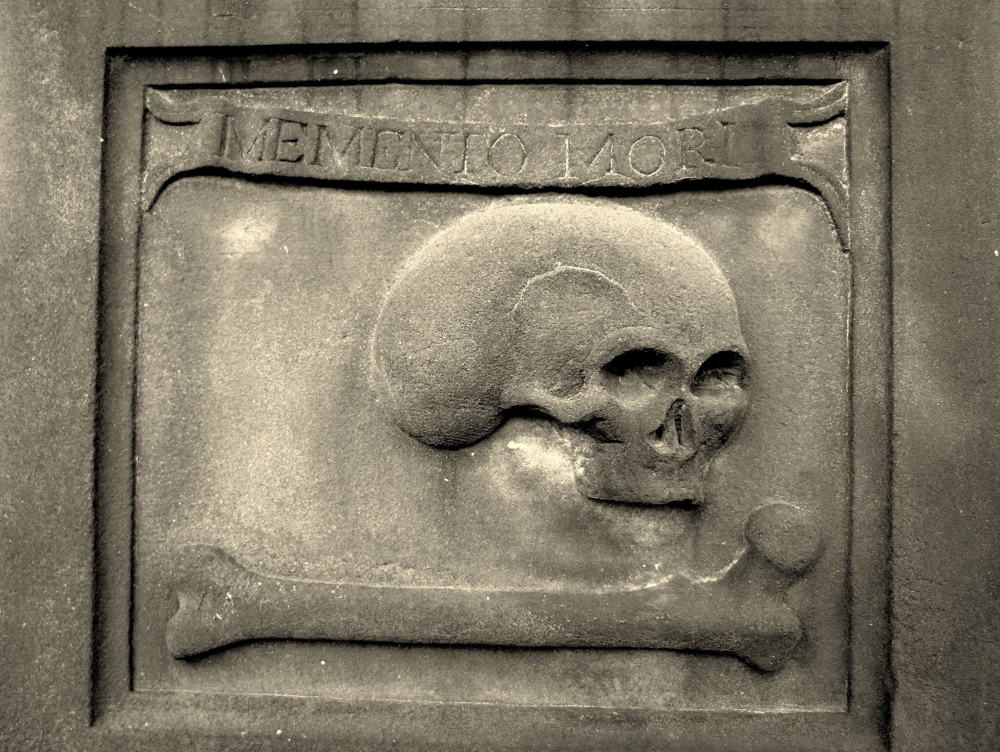

Memento Mori. In English, this Latin phrase means something like “remember that you must die”, or “Remember Death”.

The Stoic philosophers were big pushers of this idea as the core insight of a daily meditation practice. Are you worried that there are things you’re going to regret about your life when you die? What if you died today? It is *absolutely certain* that you are going to die; you might as well sit down each morning and imagine it. Do any regrets flare up about your day, or your life?

Now open your eyes. Lucky you! You’ve cheated death for a moment; you have a chance to go do something about it, to chip away at those regrets.

(Maybe your little 18 month old daughter just figured out how to open your office door and pops in during focus periods. Should you lock the door? Is the physics problem really *so important* that you’d skip one of the few moments in your life where she wants to surprise you?)

### External Memento Mori, and Digging your Own Grave

I love this practice, but it’s uncomfortable, and I often “forget” to do it for days or weeks. How can I force myself to think about my own death more reliably?

Ryan Holiday sells [Memento Mori medallions](https://store.dailystoic.com/products/memento-mori) that you can carry around in your pocket. The idea is that when you reach into your pocket for change, you feel this massive coin, and let that trigger you into a short death-meditation.

Bad news. The coin is not hardcore enough. It’s too easy to leave it by your bed in the morning. I don’t even use my pockets! There are no chances for the coin to show up in my life.

The practice that inspired the phrase “Memento Mori” was the most hardcore version possible of an external reminder of death. Brett McKay writes:

> The phrase is believed to originate from an ancient Roman tradition in which a servant would be tasked with standing behind a victorious general as he paraded though town. As the general basked in the glory of the cheering crowds, the servant would whisper in the general’s ear: “Respice post te! Hominem te esse memento! Memento mori!” = “Look behind you! Remember that you are but a man! Remember that you will die!” (From [AoM, “Memento Mori Art“](https://www.artofmanliness.com/articles/memento-mori-art/))

I think I’ve come up with a version in between these two. Imagine buying an actual, physical gravestone in a cemetery near your house, carved with your name, no death date filled in yet. It might say: “Here lies Sam Ritchie. He spent his time fucking around on Twitter and drafting long essays that he never shared. RIP!“ Or you might leave the message blank, for now.

I spend a lot of time in the graveyard near our house in Boulder with my daughter Juno, reading the graves and playing by the little shaded stream. I can imagine sitting with her at my *own* grave, a ghost instantiated. What will I want her to remember about me? The message above, or something less obsessed with completion? A grave can’t hold more than a sentence. What should it say?

Corporeal for at least a few more moments, I can still bend the arc of that very short story.

*(From [Wikipedia](https://en.wikipedia.org/wiki/Memento_mori#/media/File:Edinburgh._St._Cuthbert’s_Churchyard._Grave_of_James_Bailie._Detail.jpg)’s page on [Memento Mori](https://en.wikipedia.org/wiki/Memento_mori))*
