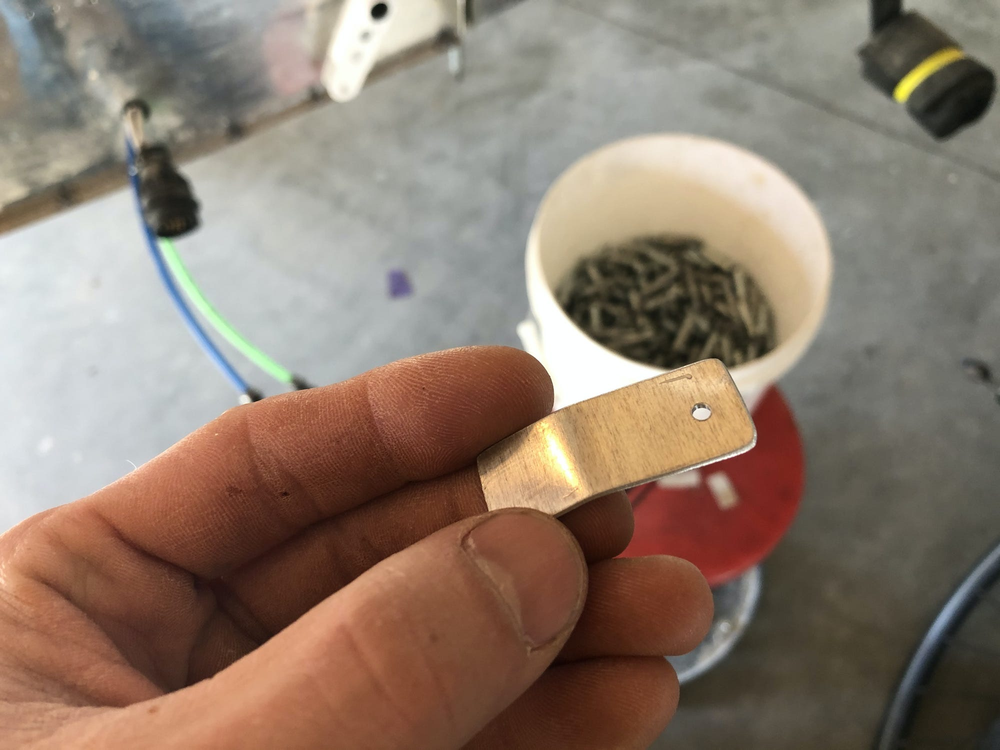
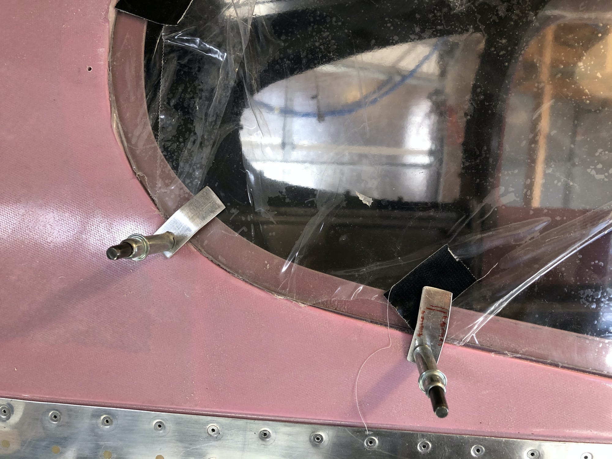
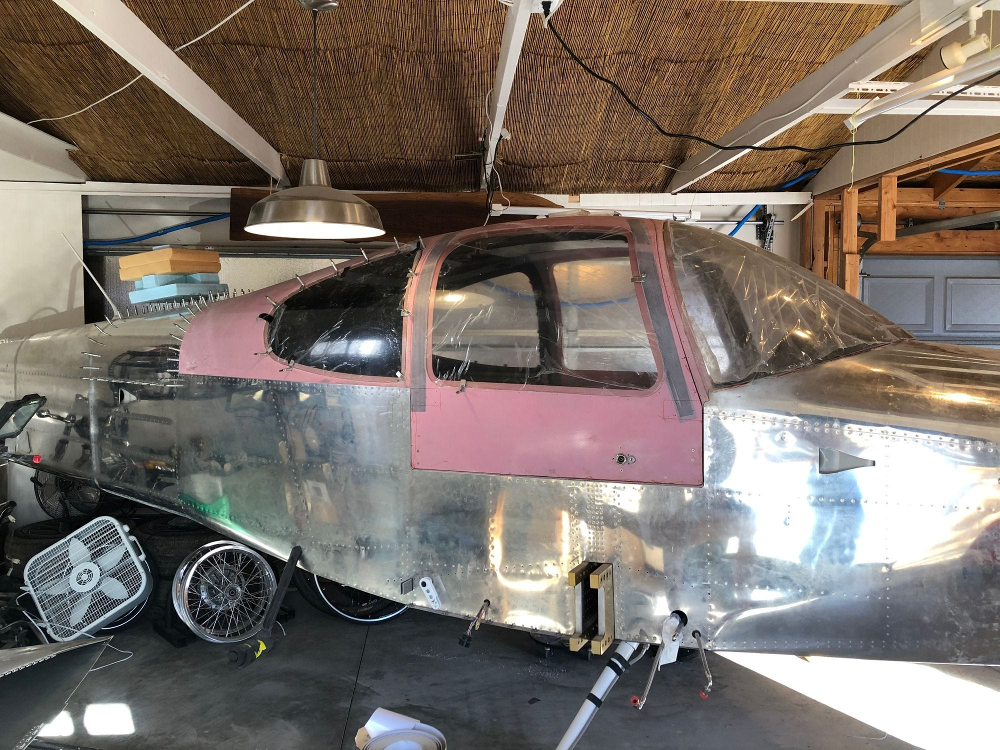

Well, here we are, close to 18 months after I left my job at Stripe and put out the call for subscribers to this newsletter. In the future, expect notes on

- my new, strange identity as an "AI research engineer", working on machine learning and evolution;
- notes on information theory, set theory, linear algebra and friends, squeezed through my mind and decorated with as much non-symbolic intuition as I can manage;
- how to take a run at difficult things outside the usual set of difficult things everyone thinks they want.

Today, a note I wrote after a day out working on the RV10 4-seater airplane I'm building in the garage.
 
 **Spring Clips and Stage Time**

I'm out here working on the plane today - I haven't made it out much, lately, but I'm in the garage spending the time. This project will end up taking roughly five years, three years longer than I thought it might when I started.

I've gone through so many oscillations of excitement and frustration out here. Some days I feel like I'm flying through tasks, and I think about how close I am to the end. Some days it is just such a grind and I feel exhausted, sanding away yet another coat of epoxy, trying to get the curve of the cabin top just right, knowing that I'm probably aiming for a level of craftsmanship that I'll never notice once the plane is up in the air.

The sweet spot is when I'm able to remember how unusual this whole project is, and how I'll almost certainly never do it again. Each task I complete is the last time I'll ever do something like this in my life. Why not be curious, and pay close attention to what's happening?

I started my day in the shop with a short, handwritten list of straightforward tasks I could accomplish today. These were:

- Make a batch of 50 little aluminum spring tabs to hold on the windows while the glue dried
- order new molex pins for the wingtip connectors
- final-sand the windows to shape

I started with the spring tabs. These are small pieces of aluminum that I'll "[cleco](https://www.youtube.com/watch?v=_DcNvt9_O3Q)" to the fuselage of the plane all around the perimeter of each window. The aluminum is thin enough to flex; each rectangle is like a small, springy clip that will put light pressure on the window in one spot. The alternative is to use duct tape, or boat straps, or weights, or any number of other ideas that feel less elegant than the one I've chosen and absorbed after reading as many other build logs as I could find.

I used my shears to cut a long strip of .050" aluminum off the edge of a large sheet of scrap, snipped off a piece about 1.5" long and used that as a template to cut successive pieces off of the strip. I took the pile to my grinder and knocked the sharp burrs off of the cut edges with the scotchbrite wheel, rotating and flipping each metal rectangle by hand. Next, to the drill press to put a #40 hole off to the side of each clip, then over to the bench vice to bend each rectangular tab somewhere in the middle. I didn't measure anything, as the exact dimensions here don't matter. I do a lot more eyeballing now, so many years into this project.

Here's one of the final clips:

And here they are in action, holding on the window:

As I was standing at the grinding wheel knocking the burrs of of these little tabs, I had the strangest feeling; I had the sense that I was in the middle of a performance, in the middle of some episode of a show I've been studying and watching for some time now. I was on a stage, performing my way through the spring clips.

I've spent hundreds of hours researching this build, and have read so many build logs... I've seen dozens of examples of each step of the project. Attaching the windows has been an impossibly-far-off-task for so long, and I've had a good deal of anxiety thinking about how far off it is.

But here I was, in technicolor, standing in a virtual reality version of those build logs. I hadn't struggled in any particular way to get here... I'd just continued to tick along, putting in the time. And now, with no thunderclap, here I was, making the simple little tabs I'd thought about for years. An hour later I was done and on to the next task. Everything is like this on the plane; maybe there's a bigger lesson, too. I'll think about it when I'm done.

If you're curious about the specifics more than Life Lessons at the Grinder, [Justin Twilbeck's blog](http://buildingrv10.blogspot.com/2014/04/installing-windows.html) is the best example of one of the window installs I've been staring at. Bob Leffler has [a picture of his janky-looking spring tabs at this Matronics post](http://www.matronics.com/forums/viewtopic.php?p=440426&sid=349c87d5e2dc05d26d890faa51eed3a2#440426); spring clips don't *have* to look good to accomplish the task, and the compulsion the same standard of "perfection" on every piece regardless of where it lives, or whether or not it's an actual plane part vs a jig, is a disease.

**If you're building anything big, you need to come to terms with that disease. If you don't have the disease, you shouldn't be building anything like an airplane.**

Finally, a side shot of the current state of affairs:

Just a couple of months to go.
