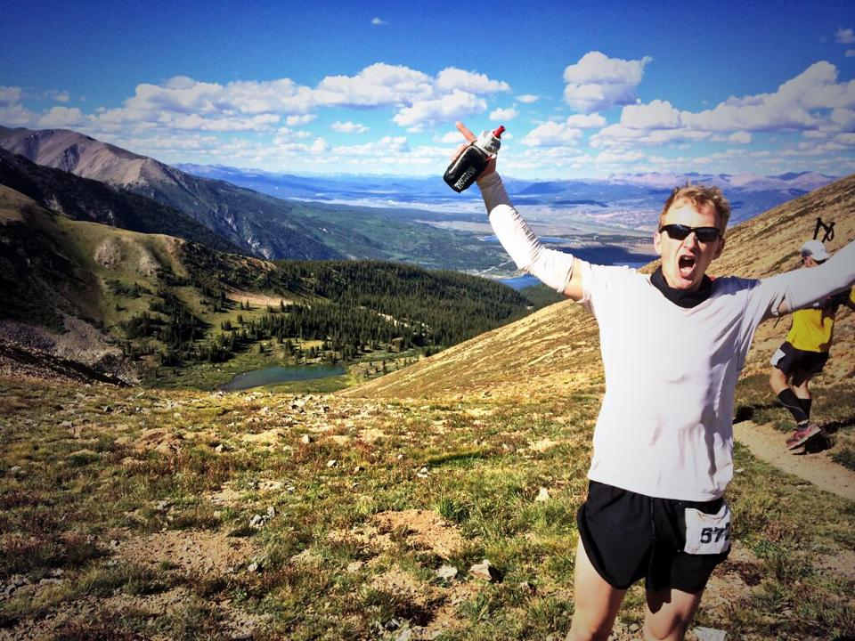

This post is about courage and failure, and how to think about success or failure when the objective is difficult.

Aaron Steele's [2014 Leadville 100 race report](https://medium.com/@eightysteele/leadville-100-6f1cfdc47fa#.317q8inpt) is one of the more honest and inspiring race reports I've read. [Leadville](https://en.wikipedia.org/wiki/Leadville_Trail_100) is a brutal, high altitude 100 mile running race in Colorado. The race was Aaron's first ultra-marathon DNF, or &quot;Did Not Finish&quot;, out of dozens of ultras. You can tell from the post that the experience scared him:

> I’ve always solved problems and moved forward. I’ve always finished the race. But on this day, at mile 50, I didn’t have the answers.

I read Aaron's report the week after the race, and I remember feeling surprised that he took his DNF so personally. I wasn't surprised that he was disappointed in the outcome. I was surprised that he seemed to see the DNF as a reflection on himself and his own reservoirs of courage. He wasn't up to the task. The TASK. The immutable task of crossing the finish line that the Leadville organizers had set out for him.

Sure, Aaron failed to finish the 2014 Leadville. But did that make *him* a failure? I want to talk about why the question doesn't make sense. The ability to see yourself as a success or failure when attacking a goal as personal and difficult as a 100 miler rests on a misunderstanding of courage and goals.

## Goals

To state the obvious, Leadville's finish line and 30-hour cutoff are arbitrary. The race is scary because the effort it requires is far beyond the limits most of us think we have. Does a 26.2 mile marathon sound difficult to you? Leadville is almost four marathons, back to back, at an average altitude of over 10,000 feet above sea level. Research the race and you'll find [videos of athletes spontaneously puking](https://www.youtube.com/watch?v=D7SaS8irSJQ) as they death-march on toward the distant finish.

Aggressive goals force you to consider that you just might have no idea what your limits are. Our identities are patched together out of limits and beliefs about the types of goals we're willing to attempt. If you don't challenge those limits constantly you start to believe that they're static. Each static limit becomes a story you tell yourself about who you are and what you'll ever be able to do.

Guess what? Your current limits aren't static. You can't know your ultimate limits unless you make a habit out of testing your current limits, and most of us don't. If you don't cultivate this habit, don't be surprised when your ego steps in and starts justifying your current limits as static and eternal. You aren't the *kind of person* who can push limits, whispers the ego. This is *who you are*.

How can you tell if this is happening? If your self-talk includes phrases like &quot;I always do _____&quot;, or &quot;It's just too late for me to try _____&quot; you're probably wrong. Your ego is boxing you in.

So what is courage? Courage is the ability to set a goal somewhere far beyond the light cast by the candle of your awareness of your own limits, acknowledge the goal's terrifying distance and prepare as well as you can to go chase it.

Courage is about reserving judgment on the reality of limits you've never even approached. Courage is believing that your limits are dynamic, and refusing to quit your attack on a limit until your body or the environment makes the decision for you.

Signing up for a difficult race relaxes the courage requirement of personal growth by setting the goal for you. Coming up with, and actually attempting, a goal as far beyond your perceived limits as running 100 miles in the mountains is unthinkable without the structure and time limit of that finish line to force you to show up and try.

## Leadville, Take Two

I raced Leadville in 2013 ([race report here](/leadville-trail-100/)) and it crushed me. I stumbled into the Winfield aid station at mile 50, 11 pounds light and shaking with cold. I sat for almost two hours, vomiting over and over as I tried to choke down salty broth and claw my way back from serious dehydration. I was able to recover and get out of the aid station before the cutoff, but the race is serious, and more than 50% of athletes drop out almost every year. Success is not a guarantee.

I had set myself an arbitrary time goal of 25 hours. I finished in 26:15. I &quot;failed&quot; at my goal, but I illuminated the path. After that race I knew what it would take to run 25 hours, and (after a few months, once 100 mile amnesia set in) I **needed** to go back and try again.

2014 was different. I'd learned what a lack of salt and hydration could do to me and was determined to correct those mistakes. I moved slowly, focused on the process and spent just ten minutes at Winfield, the 50 mile aid station that had trapped me in 2013. My 2014 goal was all about respecting process and treating my body like a machine. I stared at my heart rate monitor for hours, running calculations and administering regular salt, fluid and Ensure. The plan worked, and I ran the race in 22:38, almost four hours faster than the previous year.

Mental courage does play a part in big mountain races. Quitting before you have to is a failure of courage because you've decided in advance that there's no way the situation can improve. Nothing is going to happen that will allow you to continue, you say.

If you fail to reach the finish line, the lesson is NOT that you aren't courageous enough, or that **you** are a failure. The relevant question isn't how to become more courageous for next year; it's how to analyze what went wrong, fix it, try again and deal with the new challenges that'll surely rear up. Failing to reach a goal gives you new information about what didn't work and more insight into how to make it happen next time.

Aaron failed at his 2014 attempt on Leadville's arbitrary 100 mile finish line, just like I failed to hit my 25 hour mark. But he ran a hell of a difficult high altitude 50 miler and learned a lot about the course. He's coming back this August for a go at Leadville 2016. I know he's going to crush it, and I'm just as certain that after August's victory, some larger, more terrifying goal will arise to take Leadville's place in Aaron's sights.
