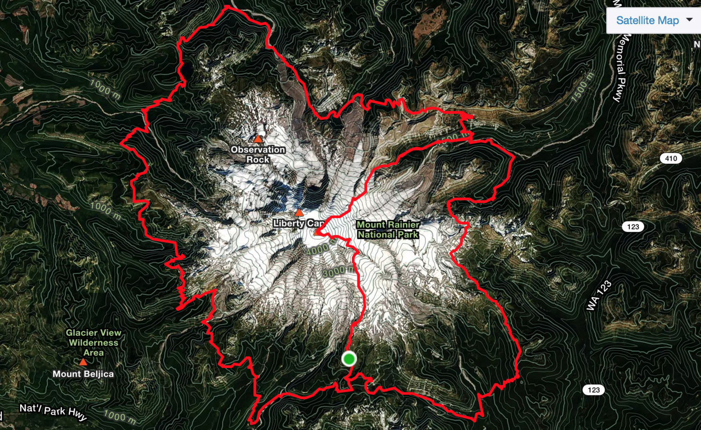
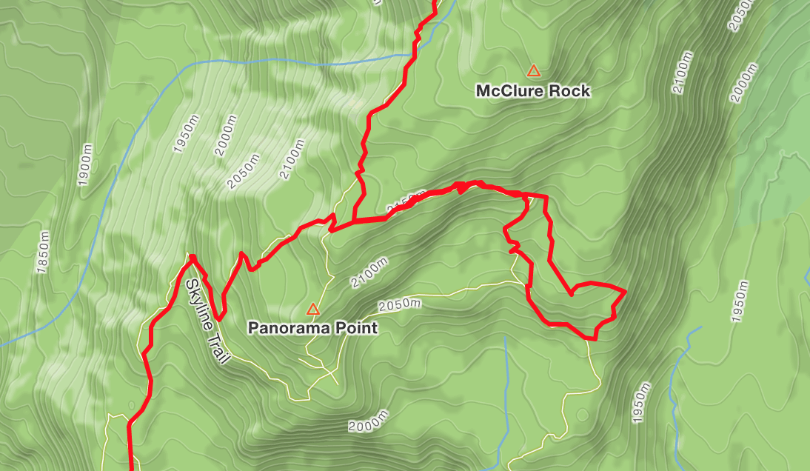
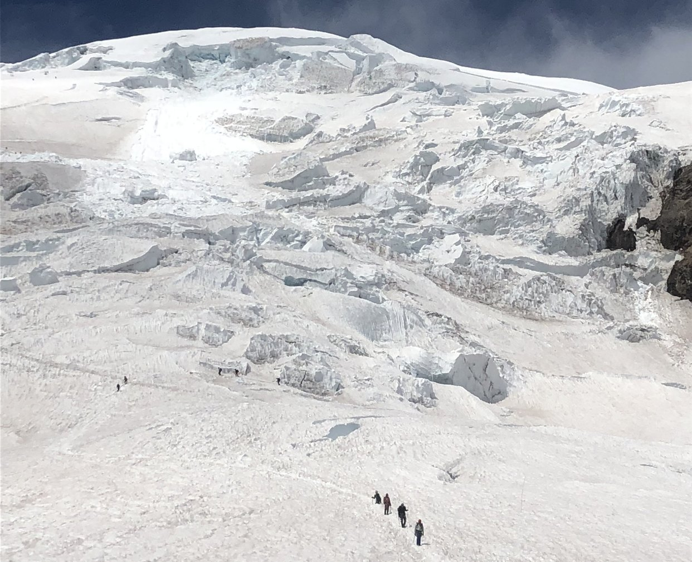

Earlier this month I attempted to complete the biggest endurance adventure of my life: the Rainier Infinity Loop, a project dreamed up by [the late Chad Kellogg](https://en.wikipedia.org/wiki/Chad_Kellogg). The line physically traces out a rather sloppy infinity sign by traveling over Mount Rainier, the most glaciated peak in the lower 48, 28 miles clockwise around its base on the Wonderland trail back to the start, over the mountain again and then counter-clockwise on the remaining 65 miles of the Wonderland trail. Knock all that out and you'll have traveled over 130 miles and climbed around 47,000 vertical feet.

I didn't finish! I got over the mountain once and around the full Wonderland trail, racking up 110 miles and around 37,000 feet of gain, but bailed on the second Rainier ascent. My partners, [Erik Sanders](https://www.instagram.com/easand17/) and [Jason Antin](http://jasonantin.com/), completed the full loop in 59 hours and 21 minutes, setting the Fastest Known Time by over 7 hours.

I'm aware that everything about those two paragraphs is insane. The Rainier experience drove home to me how deep I've traveled into the bizarre world of trail running and mountain adventure, where failing at a goal results in the consolation prize of merely *running* over Mt Rainier in 10 hours and completing the entire Wonderland trail in 30 hours - both solid life objectives - with only a few hours of rough sleep between.

As a tl;dr; before I get into the details, here are the two ungodly Strava files I generated:

- [Leg 1: Rainier Car to Car!](https://www.strava.com/activities/1699979382)
- [Leg 2: Wonderland Trail, White River to Paradise CCW](https://www.strava.com/activities/1699985174)

Jason wrote up an excellent [trip report](http://jasonantin.com/trail-running/2018/7/15/the-rainier-infinity-loop) that you should queue up as well.

The report below has many photos; those and many more live in this [photo album](https://photos.google.com/share/AF1QipMTZq3bevoDnZy1rL1h2lBZvE6UEdq_IMN6-Dle5RQ-IrlDt_DxHRTy_vujQL9gQA?key=ZnMzazZfaFk0c3c2dU5xSzRGRVBVeGYzazR1eVdR).

## Leading Up

2018 began with the sort of tension that I should know by now means a major life shift is on the horizon. I'd wake up at 4:30am, meditate, study Japanese for a couple of hours, then sit at my laptop coding for Stripe until switching focus in the afternoon to work on the airplane I've been building in the garage for the past three years. My schedule was packed. I wasn't getting outside and training; my dog Pretzel was becoming a sausage; I began to realize, helplessly, that Stripe was no longer delivering the learning experiences that I'd loved since joining in 2016. My brother Mike shamed me constantly about the small number of books I was posting to my [Goodreads profile](https://www.goodreads.com/user/show/19902817-sam-ritchie). Had I really tried to juice my numbers by adding a graphic novel? Shameful.

My life was packed, and I was coping with a growing sense that the adventures that are such a feature of life in Boulder were passing me by. Friends would invite me climbing or skiing, and all spring I'd decline, blaming the plane, worried that I'd be forgotten. &quot;I'm in the shop this weekend... but please keep inviting me!&quot;

Be careful what you wish for. In February, I got an email from my friend Jason Antin titled &quot;The Rainier Infinity Loop&quot;. A sample of the contents:

> &quot;You are on this email because you expressed an interest and I have faith in your abilities to travel on a really fucking serious mountain safely (while sleep deprived for 100 hours) and stay really psyched in the process!&quot;

The prerequisites Jason listed for this adventure were:

- Glacier Travel
- Ultra Distance (come in 200 miler fast packing, Adv Racing, or HR100 shape)
- Unlimited Stoke for 100 hours

Ugh. This was exactly the sort of trip that I would never be able to pull off on my own. If I didn't accept, I wouldn't get this chance again. Knowing that I wouldn't have time to train like I should, I replied and told Jason that I was IN! I'd figure out the details later.

About that checklist. I'd never been on a glacier. I felt confident about &quot;Ultra Distance&quot;, and my stoke hadn't cracked before on 40+ hour missions, so I felt confident on bullet three. Two out of three is good... maybe good enough to make up for the lack of the missing glacier skill?

## The Objective

Jason had discovered the Rainier Infinity Loop on an episode of the Dirtbag Diaries podcast called [&quot;To Infinity&quot;](http://dirtbagdiaries.com/to-infinity/). The story is half a tribute to [Chad Kellogg](https://en.wikipedia.org/wiki/Chad_Kellogg), the alpinist who came up with the idea, and half a piece on Ras Vaughan and Gavin Woody, the two guys that consummated Chad's vision with a 99 hour self-supported sufferfest over and around Rainier. (Chad was killed by rockfall in Patagonia in 2014 and was never able to complete to loop, leaving Ras and Gavin to get it done in his honor.) Check out Ras's [trip report here](http://ultrapedestrian.blogspot.com/2016/07/mount-rainier-infinity-loop-completed.html).

To complete the Infinity Loop, you:

1. start on the John Muir steps at [Paradise](https://www.nps.gov/mora/planyourvisit/paradise.htm) at the base of Mount Rainier
2. Climb Rainier via the Disappointment Cleaver route
3. Descend the Emmons route to the White River campground
4. Run clockwise around the world-class [Wonderland trail](https://www.wonderlandguides.com/wonderland-trail-map), roughly 28 miles
5. Repeat steps 1-3
6. Run counter-clockwise around the remaining 65 miles of Wonderland
7. Finish at the John Muir steps, back where you started.

Since Ras and Gavin's push, Sarah Morris and Nate Smith had pushed the FKT (fastest known time) down to 97 hours, spending about 10 hours in aid stations. (Here's their [trip report](https://upwardtheory.com/blog/2017/7/21/mount-rainier-infinity-loop-part-2)). Jason figured that we could get the record down closer to 90 hours if we stayed on our game.

## Partners

By June, the cluster of &quot;maybes&quot; in our email chain had thinned out to three firm commitments: Jason, Erik Sanders and me.

I met Jason Antin scrambling in the flatirons a few years ago. The RIL was designed for Jason. He's got some sort of Ironman core powering his aerobic engine, and a wild alpine climbing resume that includes a [double ascent of Denali](http://jasonantin.com/training/2018/7/15/maximizing-fitness-for-a-double-ascent-of-denali) (West Buttress and Cassin Ridge) in 2017.

Erik Sanders is an adventure racing monster. Here's an example caption from one of his [recent instagram posts](https://www.instagram.com/p/BgL_inmj2Zw/?taken-by=easand17), describing a moment SEVEN DAYS into the [Godzone Fiordland adventure race in New Zealand](http://godzoneadventure.com/history/chapter-7-fiordland/):

> My teammate Mari and I had just turned ourselves inside out battling an excruciating foot fungus (Trench Foot) on the final trek of the race. “All I need to do is get to the end of this trek”, taking it step by step, every footfall felt as if I was dipping my foot into a bucket of acid.... “No Pain” and “My feet are normal” I would lie to myself.

Holy shit. He battles out another 35k in a kayak and gets back onto his trenched-out feet for a sprint finish, mentally dominating the ghastly pain. Turbo.

What the hell, here's my post Infinity Loop headshot. (I didn't get the memo that we were supposed to look ready to kill a child.)

## Preparing

Our goal was to run the Infinity Loop &quot;self supported&quot;, which meant, for the arbitrary rules of this adventure, that we'd be allowed two camps with a gear stash at each. The most extravagant way to be &quot;self supported&quot; is to buy four separate kits of gear - one set of gear for each mountain ascent and each running leg - and stash both mountain kits at the start of Rainier and both running kits at White River. This spares you the burden of carrying your mountain boots, ice axe, rope and all of the other mountain goodies 28 miles around the mountain, as one would have to do in &quot;unsupported&quot; style.

We all borrowed as much gear as we could find to follow this plan, scrounging ice axes and pickets from friends who'd packed this stuff away for the summer. (The gear choices for the loop are so involved that I'll edit this report later to link to a separate post from me or Jason going through our thought process and final choices.)

Oh, how like an engineer to pretend that prep was all about gear! I had my running and endurance dialed from years of 100 mile races in the mountains, but snow? Sure, I've done backcountry ski races, but I've worn crampons for a total of maybe two hours, enough time to find out how awkward they can be.

Looking back I'm mildly startled at how little I did to mitigate the objective risk of the huge mountain we were preparing to tackle. I did enough research to discover the skills that I was missing:

- Crevasse rescue
- Glacier travel
- Not catching crampons on my pants every few steps

Every time I thought about pulling out Freedom of the Hills and practicing this stuff, I just... wouldn't do it! I bought [The Measure of a Mountain](https://amzn.to/2LH5j4a) and [The Challenge of Rainier](https://amzn.to/2O8WNfG), classics about the mountain, and didn't read them. More of that 2018 apathy and project overload creeping in and preventing me from putting in the time.

People in my life with big mountain experience were freaked about the whole thing. I got this note from Will Griffeth, a friend who'd climbed the Kautz Glacier route a few years ago: &quot;Do we need to talk about this infinity loop thing? I'm really not at a point in life where I'm ready to assume my godfather duties to your daughter... People have gotten into the Muir snow field, caught in white out, and just fucking died.&quot; the ensuing conversation helped wake me up a bit, and I went over to Jason's for some crevasse rescue training with Erik, and even &quot;rescued&quot; Jenna in the living room a few times.

A few weeks before we headed to Seattle, we got word that [Scott Bennett](https://ropeandsummit.wordpress.com) had [completed the Infinity Loop backwards](https://ropeandsummit.wordpress.com/2018/06/27/rainier-infinity-loop/), starting at White River, in just over 66 hours. It was strange that he'd decided to go backwards, but Sarah and Nate had handed him the FKT torch, so it was official. 66:21 was the new time to beat. Jason, Erik and I talked and decided that we would still go for the FKT, aiming for a time of under 60 hours, but that if this wasn't possible we'd still try and complete the Loop together in whatever time it took.

## Arriving at Rainier

Finally it was go time. On Sunday, July 8th, I flew out to Seattle to meet Jason and Erik. I sat on the left side of the plane and after a couple of hours... there it was! Rainier! I could see the mountain in the distance. I zoomed in with my phone and started snapping pictures.


A few minutes later a much larger mountain appeared close to the plane, close enough to see the crevasses riddling the glaciers oozing over the peak. Turns out I'd been taking pictures of Mount Adams. Whoops.

I found Jason, and we met Erik at the soccer mom minivan he'd rented for us. Next stop was the Amtrak station to pick up [Brandon Worthington](https://www.instagram.com/thebworthy/), a friend of Jason's who'd just finished the final 130 mile section of his PCT through-hike. (Brandon is an absolute stud. He was restricted by our &quot;self-support&quot; ethic from doing much for us, but he'd come out anyway to lend us his stoke. I'd wanted to meet Brandon since Jason had told me the story about Brandon's [Nolan's 14](http://mattmahoney.net/nolans14/) push fueled by instant potatoes.)

Next, on to REI and the grocery store to purchase at least 12,000 calories (200 calories per hour for at least 60 hours) each. Eating the contents of our shopping spree without the Rainier laps was a guaranteed ticket to type II diabetes, no question.

We arrived at [Whittaker's Bunkhouse](http://whittakersbunkhouse.com/), the traditional place to stay before a Rainier push, in the evening and stayed up until around 10, starting to pack up our gear for the next morning. There is a TON of history at that bunkhouse. History that I would have been familiar with had I done any of the classic preparation. I was deeply familiar with the types of cookie that I'd be chowing during my ascent of the Disappointment Cleaver... not so much with the rescue systems. Oh well. This was a jump into a special world that I'd read a lot about, but had never imagined playing in.

Brandon, the consummate through hiker, gave us the beds and slept on the floor. He actually preferred the floor, he assured us; it always took a few days to transition back to society after spending time on the trail. So badass.

## &quot;Check In&quot;

The next morning brought more indications of how unusual this trip was. We spent a couple of hours packing chips, cookies and trail mix into ziploc bags of 200 calories each and preparing our little trail running &quot;fastpacks&quot; for the mountain ascent. A few hundred feet away on the lawn, mountaineers on guided trips organized their 60 pound frame packs and camping gear, getting ready for four days on the mountain. They were actually rehearsing mountain skills! Our most contentious discussion was whether to wear trail runners with strap-on crampons or actual light mountaineering boots for our 10 hour push.

Finally ready, we drove to Paradise to get our climbing permit. The first ranger we talked to grew increasingly unsettled as the conversation developed.

&quot;How much food are you each carrying?&quot; she asked.

&quot;200 calories per hour, so around 2,000 calories per person,&quot; Jason said.

This took a moment to sink in. &quot;...how many *days* of food are you carrying?&quot;

After we tried to lay out our timeline for Wonderland and two ascents, the ranger went to grab her manager, a Smokey-the-bear uniformed guy named Jason Olsen.

&quot;Infinity Loop? Okay, tell me your timeline,&quot; he said. He was familiar with the idea since Scott had come through just a few weeks before and greased the process for us. We laid out our splits for a 60 hour finish, six hours faster than Scott's time, knowing that we could be out for potentially days longer than this estimate.

Back to the car, back home to get our White River drop bags then off to the campsite. The drive was much longer than we realized, close to two hours, but Brandon managed to knock the time down to an hour and a half with some aggressive handling of the minivan. At one point he hit a roller so hard that we achieved liftoff, freaking out the pickup truck tailgating us into backing off permanently. Each time the tires squealed around a corner, Brandon would say, &quot;thanks so much for letting me drive, guys!&quot;

It was a solid warmup of the adrenaline system. If we could survive the drive, how scary could Rainier be?

Here's a shot of the team at White River campground:

We were so innocent then! We were back at Whittaker's Bunkhouse at 9pm, and decided to start at 5am the next morning to get as much sleep as possible before the epic began.

## Mountain 1

Our alarms went off at 3:30am. Prep was like any other endurance race. Lots of lube on every part of the body that might chafe. Clothes on, check the packs for food and water, check the headlamps and get everything to the car. The temperature was great, with a touch of fog in the air, not too cold. Brandon drove while we sipped Red Bull and dined on Jason's signature peanut butter and Nutella tortillas.

We arrived at Paradise with 30 minutes before go time. Light was just filtering through the fog. Would I be warm enough? How cold could it be up there at the summit, 9,000 feet above our current elevation? Nothing to do but wait and see.

We started the watches and said goodbye to Brandon at 5:01am, moving quickly up the Skyline trail. The trail is paved and technically &quot;handicap accessible,&quot; but very steep. 30 minutes in, lured by the nice surface we missed our turnoff and wasted a half hour cruising around off trail before seeing our footprints and getting back on track. It's pretty obvious on the [GPS track](https://www.strava.com/activities/1699979382):

We all had [Gaia](https://www.gaiagps.com/) on our phones for navigation, and we treated this as a good early reminder to check the map often instead of guessing.

Soon we were on the Muir snow field, above 7k elevation in no time. The fog started to lift and we got our first glimpse of the mountain as we trudged upward on crunchy snow.

I remember thinking that the mountain honestly did not look that big. Why was this such a big deal? It turns out that the mountain would continue to look &quot;not that big&quot; for the next few hours... the summit never getting any closer. My mind was interpreting the massive seracs, boulders and other snow shapes that I didn't know how to name as little snowball sized things and calibrating the mountain down. In reality it was HUGE, with 7,000 more feet of glaciated terrain above.

Camp Muir stayed &quot;close&quot; for another hour, before finally we arrived, saying hello to climbers drinking coffee outside of the bunkhouse and moving through to the cook tent past the main area.

### Camp Muir

Jason knew the ranger at the cook tent, and he was able to get information about the upper mountain while we put on more sunscreen. My friend Michael O'Brien had lent me his glacier glasses, noting that &quot;once your eyes get burned you're going to be in for a bad day.&quot; Apparently folks also get bad burns on the inside of their mouths from the reflection of the sun off of the glistening glacial ice. I slathered up, taking no chances, and still managed to get burned between my eyes where the bridge of the glasses thinned out.

We decided to delay putting on ropes and crossed a mellow snow field near our first crevasses. The snow was covered in rocks that had fallen from the cliffs above and rolled down. You could hear this happening every few minutes as the sun melted the ice locking the rocks into place.

Jason had noted that this would happen, and called Rainier &quot;Casual and Terrifying&quot;. Casual because the aerobic effort involved just wasn't that big of a deal given the time we all spent in the mountains... terrifying because the mountain is a shifting mass of rotten rock and man eating crevasses.

A sample of my thoughts from my first time in glaciated terrain:

&quot;Where do all of these rocks come from? How do they get... replenished?&quot; This felt too stupid to ask, so I stayed quiet.

&quot;How dumb would you have to be to fall into a crevasse? They're so huge and obvious.&quot; Well, turns out that in addition to the huge exposed valleys, hidden crevasses lurked everywhere, covered by layers of snow of variable thickness. The exposed cracks in our pictures aren't the problem. It's the cracks covered in thin &quot;snow bridges&quot; that can swallow you, especially later in the day as the sun warms everything up.

We kept our eyes up for rockfall, spaced out and moved quickly over to the Cathedral Rocks ridge and up onto Ingraham Flats, where more parties were camping. The snow started to become more wild and textured:

<figure class="kg-card kg-embed-card"></figure>
We met a group from the Denver area that was a few days into their push to the top. They were very friendly, but seemed to grow more alarmed as they eyeballed our minimal gear. When had we started? Did we have any other adventures planned in the park after this? Finally, I laid out the details of the Infinity Loop... and it just shut down the conversation. It was like we were a group of aliens in possession of ancient galactic wisdom, and I'd goofed and overloaded their minds with too much all at once. Full system overload.

We roped up here and I tried my best not to look like an idiot. My troubles with crampons began right away. I was in the back of the rope team behind Erik and Jason. Five minutes in to our rope walk, trying to eat a bar and drink as I was walking, I caught a crampon and took a dive, ejecting my second water bottle and a few bars onto the narrow path ahead of me. I didn't want to stop the team, so I jumped up and tried to stow the items while still moving, all while the slope got steeper. I stuffed the entire bar into my mouth, shoved the bottle into my jacket and tried to focus on my feet.

I kept tripping! Previous parties had carved out a highway and the snow was so textured that I didn't feel in danger of a full tumble, but clearly some practice would have helped. Nothing to do now but trudge.

We reached the &quot;bowling alley&quot;, an area tight against a rock wall where falling rocks would give us no warning. We hustled through safely to gain the route's namesake, the Disappointment Cleaver (DC) ridge. The DC was easy, maybe second class hiking. We tightened up and and coiled the rope loosely, thanking the parties that paused their descent from the summit to move aside for us.

After the DC we hit snow again. Our next obstacle was a massive icefall that had obliterated the route a few nights before. Huge blocks had fallen in the middle of the night in what a [ranger's post](http://mountrainierclimbing.blogspot.com/2018/07/dc-update-objective-hazards-become.html) called an &quot;unsurvivable event&quot;.

Here's [a news article that appeared in the Seattle Times](https://www.seattletimes.com/seattle-news/this-would-have-been-an-unsurvivable-event-when-a-glacier-crumbles-on-mount-rainier/) about the icefall, and a picture:

There were more huge blocks hanging above the route. As we approached, Jason called out that we should move FAST, and started pushing. Right as he started moving, I kicked my crampon and it popped off. I yelled, we stopped, and Jason moved back out of danger and I fixed the crampon, nerves tightening just a bit. We jammed across the ice flow to safety.

The remaining few thousand feet consisted of long, steep switchbacks up snow that was softening in the sun. I focused on copying Jason's &quot;french step&quot; technique, saving my calves some work and catching my crampons less. Talk about learning on the job.

Here's a sample of the crevassed terrain, and my second crevasse ladder crossing ever:

The windstopper R1 and long sleeve baselayer combo I was wearing were perfect, given our pace, and my feet felt great in light boots. I was glad I hadn't gone with the less secure trail running setup we'd been considering.

Rainier is a mountain of many, many false summits. It's just absurdly tall. I've never trudged almost 10,000 vertical feet with no downhill at all. Where else can you do that? Hours of trudging without expectations.

Suddenly, at the end of a long switchback, we jumped across one final crevasse into Rainier's volcanic crater. The crater is flat, and hustling across I got sloppy again and kicked off the same crampon. I sat down, fixed it and we pushed on to the other side of the crater and the true summit of Rainier. We hit the summit in just about 6 hours, right on schedule.

We snapped a few pictures and took a little video:

<figure class="kg-card kg-embed-card"></figure>
And just like that, the climbing was over. It was time to descend Emmons.

## Emmons Descent

Right away it was clear that Emmons was more serious terrain. There were no tracks to follow, but Jason had skied the route before and took us down in the correct direction to begin our 10,000 foot descent to White River. Here's a shot from a section with a nice kicked in traverse.

Much of the upper route required good crampon technique, which we've established that I did not have. I started to get spooked. I knew if I went slow there was no reason anything should happen, but I just couldn't stop thinking that I was going to catch my crampon and start rolling thousands of feet down the mountain, dragging the rope team with me into a crevasse. I'd never actually performed a self arrest. What the hell was I doing up here? I started leaning into the hill and shuffling my feet, building up a nice burn in my quads on the long traverses, making every classic mistake, like trying to edge with the crampons instead of rolling my feet to give the points more of a bite. I knew what to do but couldn't execute.

Here's a shot of nervous me kicking down a snow slope toward Erik.

Eventually I started to numb out. The guys were wonderfully patient with me here, and when I started to go too slow they switched me into the lead position so that I could set the pace. It would also be easier for the group to self arrest if I took a tumble in this configuration.

We could see our first checkpoint, Camp Schurman, thousands of feet below us. The crevasse crossings on Emmons were more frequent than the few we encountered on the DC. They look like slight depressions in the snow, but if you tracked the depression sideways it often opened up into a yawning maw in the ice. The goal is to either jump over the depression or find the thickest point.

I didn't know what I didn't know! I didn't know how nervous I was supposed to be, so my brain settled into a state of &quot;low grade freaked&quot;. I felt like I was getting away with something. Why hadn't I practiced this? What the hell was I thinking?

After a while Jason stopped us and said, &quot;Sam - do you mind if I give you some advice? Try this - just relax.&quot; We had started to see the remnants of a trail, which meant slightly better footing. I attempted to relax. I started bouncing my shoulders as I walked, like an old person doing an impression of a young person that didn't give a fuck. It worked! My body became more upright, and I started moving more quickly to Jason and Erik's encouraging cheers.

We passed a couple of &quot;cattle drives&quot;, or large groups of guided clients, and I continued faking my confidence, moving below their track, kicking steps into fresh snow. It felt so damned steep. I focused on not falling in front of the whole group.

The problem with being nervous like this is that time flies and you stop eating or drinking. I found out later that Erik had run out of water at the top of the hill. The heat was getting intense, and the snow began to melt into mashed potatoes.

Finally, the heat now intense, most of our water gone, we reached the first parties camped at Schurman and had another one of those conversations with a group cooking outside their tent.

&quot;Hey, nice work! When did you guys start?&quot;

&quot;Just about 5am.&quot;

&quot;From here? We don't remember seeing you this morning...&quot;

And so it went. More reminders of how unusual what we were doing was.

After a brief stop for bathroom and sunscreen at Schurman we kept descending, down into the mist and out of the pounding sun. Soon we were on the Inter Glacier, running downhill in softer snow, unaware of large crevasses all around us hiding in the fog.

The scary part of the descent was over, and I found it hard to recall the physical sensations of fear that had run through me just an hour before. I resolved to keep reminding myself, and started getting nervous in advance for the second climb.

Suddenly, a glissade track! We sat down and started sliding. This was my first time glissading, and it was just SO DAMNED FUN. Jason led the team, smashing out a perfect luge run for me and Erik.

<figure class="kg-card kg-embed-card"></figure>
We lost about 2,000 feet in 15 minutes, ran out the final portion of snow and hit the trail. I switched my boots for the Altra trail runners I'd carried in my pack and we ran the three miles down to camp, eating our remaining food as we moved, passing more guided parties on their approach to Emmons. Compared to the boots, my Altras felt like little deerskin slippers, and we were down to the campsite at White River in no time. We'd completed the first leg of the Infinity Loop.

## White River to Paradise

We'd budgeted 45 minutes for our transition, but the goal is always to get out of the aid station as quickly as possible. Making up time by hustling here is much easier than running faster. I dumped all of my mountain gear and loaded my running food, headlamp and a few light layers into my pack, along with a piece of gear that I'd come to regard as almost magical - the [Katadyn BeFree softflask](https://amzn.to/2uNJ3z6) filter bottle. We each carried one of these and an additional soft flask, just one liter of total capacity, for 93 miles, filtering water from the many streams on the Wonderland trail. After 43 minutes we were ready to run and cruised down the road and out to our right turn.

The first few miles of trail were beautiful, flat and perfectly buffed. Would the trail be like this the entire way? We needed to run something like 20 minute miles to match our goal time back to Paradise. the whole Wonderland trail has over 22,000 feet of elevation gain, and the trail gods were clearly trying to lure us in to blowing our energy on this tempting flat cruiser section.

Everything is temporary, and sure enough we were soon climbing again. I'd warmed up and felt physically great. We were out of the heat of the day thanks to unexpected cloud cover. The trail grew rockier as we moved up out of the forest, getting the rhythm down, eating salt and food.

Here's a video from one of our first water filling stops. (Notice Erik casually drop that his vision has been blurring out for a while now. What a dominator.)

<figure class="kg-card kg-embed-card"></figure>
A girl sitting by the trail watched this whole conversation with suspicion. She asked where we were going, and I replied that we were running back to Paradise, over 20 miles away. Her eyes were troubled.

&quot;What, we don't look like we can make it?&quot; I said.

&quot;...It's just that your packs look very small.&quot;

If only she knew where we'd come from. We kept climbing and hit a snowy traverse. Here's the entrance onto the first snow field:

<figure class="kg-card kg-embed-card"></figure>
It was colder on the Wonderland section than at any point on Rainier! We kept moving, shivering and covering up with a buff any time we had to stop.
<figure class="kg-card kg-embed-card"></figure>
This is where the dark thoughts began. There is a lot of time to think on these long runs, and unexpectedly, monitoring my state, I began looping on the feelings I'd had on the top of Emmons. Was I really going to go up there again? On such low training?

It got worse. I've had a number of friends that have torched their endocrine systems digging too deep... what the hell was I doing? It might be dark on the next descent. What if I trip? Am I putting the team at risk? I'll blow the FKT for sure with the extra hour that it takes guiding me down.

Just endless, calm, bad thoughts. I watched, fascinated, as part of me built the case for why I needed to quit. Slipping around on Wonderland's easy snow climbs in my Altras didn't help. Snow is Jason's happy place, and I knew he couldn't wait for the mountain. I was dreading it.

Okay... so I was going to quit. I was going to quit for the safety of the group. Well, no, that sounded like I was trying to avoid responsibility for bailing. I'd just say that I was scared. When would I bring it up? On and on, calmly plotting, running the whole time.

Even this internal dialogue felt like betrayal. To distract myself I asked Jason and Erik - would they like to hear some stories about mushrooms? I'd been on a mycology research bender after hearing [Paul Stamets on the Joe Rogan podcast](https://www.youtube.com/watch?v=mPqWstVnRjQ), and was full of facts. They indulged me, and thirty minutes later I was in a great headspace again, moving over the beautiful rocky trail into dark forest.

Back to the Wonderland. The trail really was world class. I got to foot-glissade for the first time in my life, taking the downhills on my heels down snowfields. Every time we hit a pass or turned a corner we could look back and see Rainier looming. It felt like Middle Earth, with massive green fields below us in the distance and mountains extending back forever. I can't say I looked great:

The campsites on the trail were absolutely wild. Here's a shot of the entrance to one of the group sites nestled in the endless snow of the July Wonderland trail. This little wooden bridge spanned a stone-lined waterfall with perfect, clear water roaring down.

<figure class="kg-card kg-embed-card"></figure>
I lost my sense of time passing, other than a repeating thought that we seemed very far away from our starting point. These 28 miles were some of the rougher miles I've run on trails. We completed a huge descent down off of the snowy section, finally, back on soft trails through old growth forest, and made it to the road at Box Canyon before putting on our headlamps.

Just out of Box Canyon we encountered a sign that read, &quot;Rough Trail, 5 miles.&quot; Really? They should have posted this 20 miles back.

Physically I was enjoying the uphill, and the trail *did* get rough, narrowing as we approached a river, huge jungle leaves crowding in around us and masking a large drop down to the water to our right. Long push up to Reflection Lakes, and there was Brandon, cheering us on and marking just a couple of miles to go to Paradise.

### At the Car

As we ran up to the car, my Fear loop surged back into my head. I was angry at myself for feeling so physically good. I was the chattiest member of the group at this point, and I'm sure no one could tell what I was thinking. I started to think that I should just keep going. Back and forth to the last minute.

Finally, it was time. Jason said, &quot;I suggest we get to the car, brew up some hot water and food, rest for an hour and get out of here. Erik, what do you think?&quot; Erik was on board.

&quot;Sam, how about you?&quot;

I was so self conscious that I can't remember exactly what I said. I fumbled out something that boiled down to &quot;I think I should... not continue.&quot; There it was.

Jason sounded very surprised. &quot;What? You can't bail!&quot; Erik assured me that we were all crushed from the run - we could wait longer than an hour, it was no problem. I couldn't believe I was bailing. The conversation continued in the van. The guys were amazing here, offering so many options and ideas for how to make the descent safe. In retrospect, I think it *would* have been safe; certainly safer for them with a rope team of 3 than with just 2. But I couldn't shake the feeling that I had gotten away with something, and that if something bad did happen it would be my fault. I could have prepared, and didn't.

Jason understood what was going on in my mind, and soon the guys &quot;gave in&quot; with one request: &quot;will you run the Wonderland Trail with us?&quot;

&quot;Yes. Yes, I'll do that.&quot; It was done.

I switched into &quot;pacer&quot; mode, so relieved, and helped Erik and Jason talk through the plan. After a short nap and food they were out of the van, two studs getting after it for the second time in less than 24 hours.

Again, the unreality of it all. I had just run over Rainier and back to the car! I was proud, emotional at the idea that I'd bailed on an objective, but happy with the concrete choice. I'd learned a big lesson.

### Campground

I drove back to White River with Brandon and crawled into the tent for a few hours of sleep. We drove into town for breakfast and my phone flooded with messages from a family text thread, cheering me on on the second mountain ascent. I called Jenna and told her what had happened. She was supportive and happy I was safe, and psyched that I was going to continue on the run.

Back at the campsite, we spread out all of our extra food on the picnic table and waiting for the boys to get in. I jogged up the trail for about a mile, and there they were, looking pretty wrecked, smeared with sunscreen, smiling and safe.

&quot;Get some!&quot; I yelled, done with rest, excited to get back into it. I ran into the aid station with the guys, participated in the donut feed session and paced around quietly as they tried to sleep for a couple of hours.

<figure class="kg-card kg-embed-card"></figure>
Finally, it was time. Erik and Jason got up and we all got ready, packing for an expected 26 hour push back to the Paradise. By the time we left roughly 39 hours had elapsed since the adventure began.

## Run 2

From that first left turn onto the Wonderland trail I knew I was back in my comfortable ultrarunning headspace. I know how to focus and run for a 100 miles, eating food and salt on the clock; we had 65 to go. I knew that I was more rested than the guys, and that I could help by staying focused and setting a pace, setting a good mental direction. I don't know if they saw it that way, but it felt nice to step up and contribute again to the team.

The remaining 65 miles was a backcountry epic on great trails. I think we crossed two roads in the first 60 miles? It was the most remote running adventure I'd ever been on, hands down.

The first long climb to Mystic Lake was gorgeous. Rainier would pop out of the trees, causing momentary overexposure for a second. The sun was setting but it felt like you were looking at a bright mid-day sky before the mountain resolved against the background.

We broke out above treeline onto a section of unbelievable alpine running on buffed trails as the sun set. We were all whooping and yelling and the guys looked remarkably good, considering the short amount of rest. Rainier loomed above.

We hit our first big descent as the sun was setting. Something about the exhaustion going in forced me to relax my shoulders and just flow down the trail. We were moving *fast*, hauling ass. I'm shocked no one caught a foot with the damage we'd already taken. We kept up the pace for every descent on the run, save the hellish second-to-last descent to Longmire. I don't think I've ever moved so efficiently down steep switchbacks.

We put on our headlamps and got into the zone, moving past views that were probably beautiful, but who knows? We lived in our little circles of headlamp light, stopping only to fill water at one of the many clear streams that crossed the trail.

Another descent in the dark, this one through rough rock and lasting something like ninety minutes. The Wonderland trail loves its massive climbs and descents, thousands of feet at a time. Jason was hammering the descents as well, Erik suffering behind us with a knee that had been giving him some pain for many more hours than he would admit to us.

Sometimes you have to go to a special place to make it tolerable. We passed the time with some group singing:

<figure class="kg-card kg-embed-card"></figure>
Next, a monster climb up to Ipsutz pass. Near the top we laid down under an overhanging cliff, content, exhausted, happy to take a break and look at the stars. Then, WHAM.

&quot;What the fuck was that?&quot; yelled Erik from his prime bathroom spot down the trail.

Rockfall. Awake again, the spell broken, we scrambled up and got moving.

We kept eating 200 calories per hour, no stomach issues showing up, eating so many chewable salt tablets that Jason burned an ulcer into his tongue and I had trouble swallowing anything for a couple of days after the adventure.

Our only real obstacle was the South Mowich river. The trail is full of log crossings over fast glacial rivers. We hit the South Mowich as the sun was rising, and could see the log with its handrail smashed and out of commission on the other side of the river. Immediately Erik went into Adventure Racing mode and started scouting for a way across. A few minutes later, he yelled,

&quot;I found a log that we can use!&quot;

Jason was suspicious, and more wise than me to adventure racing route suggestions. &quot;Is it smooth?&quot;

Quiet. &quot;No. Maybe we could try something else.&quot;

Eventually Erik found a system of logs that we could shimmy across. We called our inner thighs into service and got after it:

<figure class="kg-card kg-embed-card"></figure>
I couldn't imagine trying to do this with the huge pack that most through hikers had to carry. Another obstacle dispatched, we started to climb again.

I chewed my first piece of &quot;Military Energy Gum&quot; a few minutes into the climb. I wasn't sure if it was working, then noticed that I was chewing very aggressively and stabbing my trekking poles hard into the dirt. Game on! Jason chewed two pieces and moved to the front spot, setting an aggressive pace for the hour long climb to Golden Lakes.

We could see Rainier again at the top as we jogged to Golden Lakes. Everything around us was huge. Massive peaks, Rainier in the distance, walls of enormous trees... Jason dubbed Wonderland &quot;the anti-Colorado&quot;, based on the lush activity everywhere.

Time was warping as we kept moving, sticking to the routine. We passed a campground and ran into the first human we'd seen since Brandon, an older man in slippers.

&quot;You boys look like you're on a mission!&quot; he said, smiling at me.

&quot;We're headed somewhere!&quot; I yelled, happy that we'd gotten through the night, covered in sweat and salt with my little running pack bulging with cookies.

&quot;How long you been out?&quot;

I looked down at my watch. &quot;52 hours.&quot;

His smiled dropped away. &quot;How many miles is that?&quot;

I checked again. &quot;Looks like about 110?&quot;

&quot;JEEEZus!&quot;

At the next water stop we ran into a group of through hikers on an eight day push. Making conversation, one of the hikers noted that he'd &quot;been over the mountain a few times, but never around it.&quot; I replied that we were in the same position.

&quot;Where are y'all running from?&quot;

&quot;White River.&quot;

&quot;You're not training for that Infinity Loop thing those guys did a few weeks back, are you?&quot; he asked.

&quot;We're actually in the middle of it right now!&quot; and we were off again, bounding downhill, Jason leading us. Jason got a massive burst of energy at this point and we clicked off the next five miles just flying down the gentle grade. I was a little concerned. We still had 20 miles to go, and Jason was almost clicking his heels, leaping over roots for fun.

&quot;Don't blow your wad...&quot; I said quietly, right behind him, Erik right behind me.

Jason slowed down a touch, still fast, saying, &quot;I'm not... but we might as well get the seggy, yeah? It's going to do the same damage whether we run or not.&quot; Fair point. &quot;Getting the seggy&quot; meant getting the fastest time on the (fictional) Strava segment for this downhill. After all, why run if you're not chasing seggies??

I couldn't help but get infected with the excitement. I did some cautious trail math, and realized that if my distance estimates were right we were on track to break 60 hours. We had to keep it together in the heat of the day and make it back without any major mistakes and we'd get it.

More climbing and descending. The terrain was so big. Just look at this bridge:

<figure class="kg-card kg-embed-card"></figure>
Here's a report I gave from the trail on a climb not long after this bridge crossing:
<figure class="kg-card kg-embed-card"></figure>
Erik's knee had recovered by this point, and he was back in adventure racing mode, was always doing something, mixing up instant potatoes or mountain house meals with cold water, tidying, moving items from pocket to pocket. He developed this rhythmic walk that seemed to cycle over many strides, a brilliant move that allowed him to tap into any unused muscle that was willing to assist in the climb:
<figure class="kg-card kg-embed-card"></figure>
As the morning proceeded the heat started to get to me. We were passing frozen lakes, tempting me with their floating ice blocks. I'd stare at the ice and yell at the guys to pack snow into their shirts, pour water, ANYTHING... we had to beat the heat! I found out later that they just weren't that hot, and confused about the big deal I was making. Damn, another weakness.

The second to last downhill marked roughly 15 miles to go. Here's a shot of us cruising in the full heat of the day:

<figure class="kg-card kg-embed-card"></figure>
The final downhill was a mindfuck. From the topo, we were expecting a gentle seven mile descent before the final five mile climb to the finish. Of course we should have known that nothing is gentle on Wonderland. The descent was seven miles of rollers, with a big climb stuck in the middle. It wasn't that different from anything we'd seen before, but the expectation that we'd be getting a break set us up for... mental difficulties, shall we say. We stopped talking to each other, privately suffering.

Finally we hit the road, the bottom of the descent and our last major checkpoint - Longmire, 5.6 miles to go to Paradise. We were each out of water, and considered running into the Longmire campground to try to find some, but the clock was ticking on sub-60 and we decided to go for it and pushed on.

The last section was brutal. The last bit of an ultra always manages to be brutal, whatever the distance. We'd been running for over 20 hours; Erik and Jason had been pushing for over 57 hours. The trail paralleled the river and we could hear water, oh so close. We didn't cross it for miles. Finally we found a spot where we could bushwhack down the bank and took it, pouring water over our heads and filling up one bottle each for the last push.

We must have looked outrageous to the other day hikers, like three dudes from sea level out of their depth on the worst five mile hike of their lives, soaked, yelling at each other to GO GET SOME, we're so close! I'm sure no one around us suspected what was happening.

Systems shutting down, we hit the Narada Falls trail for a final 1000 feet of climbing... and then, there it was, the road, jammed with parking cars and people walking around with melting ice cream cones.

I backed off and pulled out the camera, letting the boys run ahead to finish out the Rainier Infinity Loop in 59 hours, 21 minutes, breaking Scott's FKT by over 7 hours.

<figure class="kg-card kg-embed-card"></figure>
Here's a shot of us next to the Muir steps where it all began:

## Concluding Thoughts

The Rainier Infinity Loop was so huge that even the *attempt* at completion was the biggest adventure I've ever had in the outdoors. Running over Rainier in a single push? Check. Running the entire Wonderland trail with two soft flasks? CHECK. A proud week, as Jason pointed out in the car as I was bailing.

The mountain portion was an incredible introduction to the alpine environment, and I'm so grateful that Jason and Erik brought me onto the team with my lack of experience. The push revealed some holes in my armor, and I didn't enjoy the headspace of that first run... but it's good to get your ass kicked every once in a while. What a way to get humbled.

The beauty of goals this audacious is the recalibration that they give you on your own abilities. The RIL attempt did that for me in a big way by jolting me into realizing that I have the endurance base to take a more active role in planning and designing adventures like this.

Cheers to Jason and Erik, to new friends and to an epic week of playing in the mountains!
