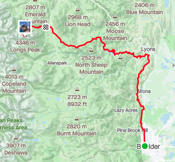
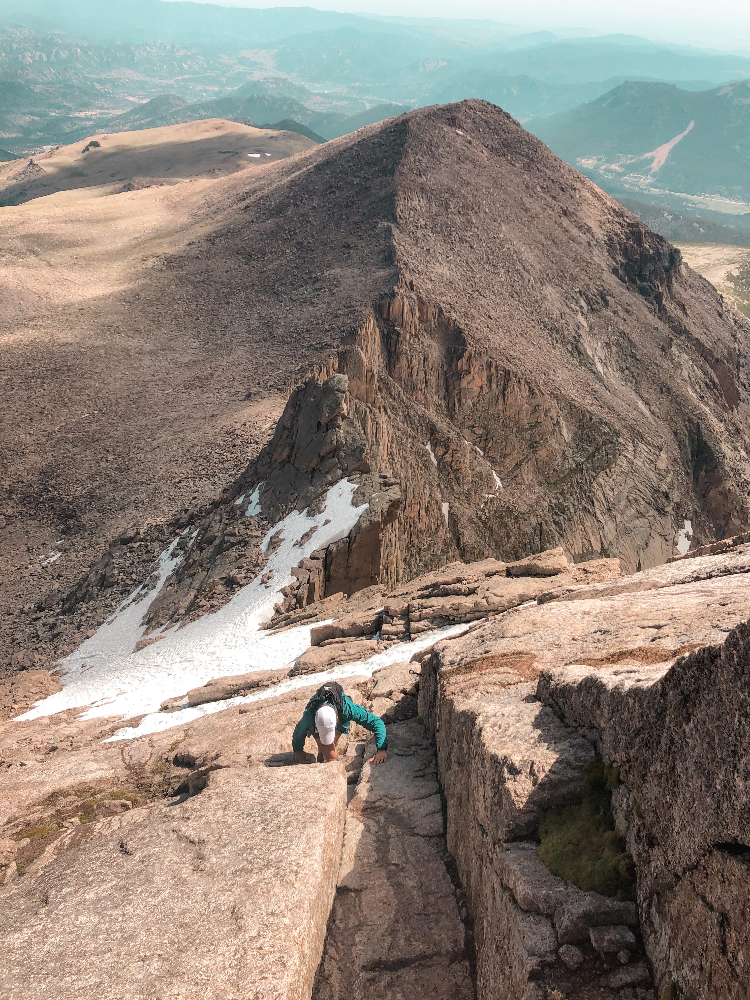
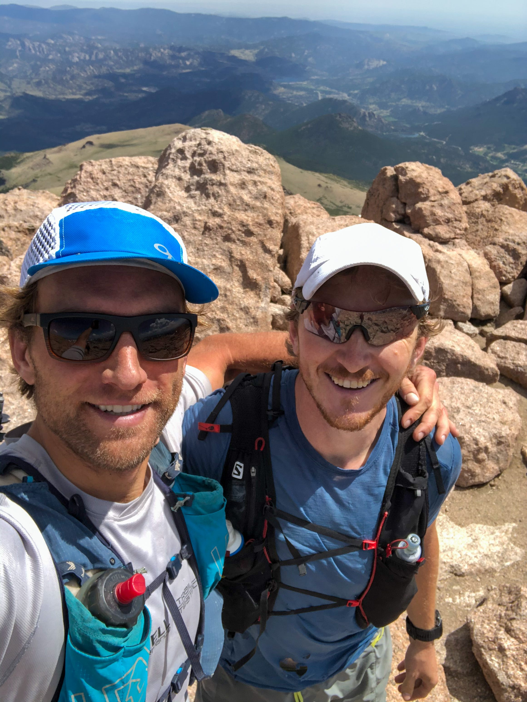
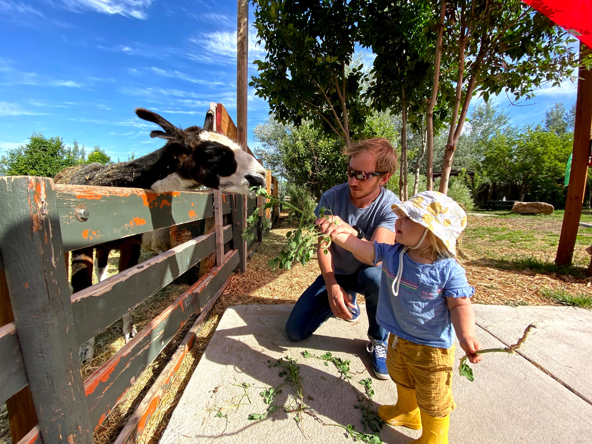

I’m a big believer in off-the-couch adventures, and the idea of the “spot check”. If you invite me on an adventure for which I’m mildly unprepared, I’ll use my brain and say no. But if you ask me to do something that is *obviously stupid* given my lack of regular training, I can’t help but take it as a little *test*, a spot check from the universe, and say… yes. Please, please yes.

So when my friend Mike Chambers asked me if I wanted to join him for a run up Long’s Peak, starting from Boulder, what was I supposed to say?

We left Pearl Street at 8pm and [carved this 53 mile track](https://www.strava.com/activities/3709549479) up to the 14,259’ summit of Long’s Peak ([strava](https://www.strava.com/activities/3709549479)):

My trip reports tend to become [overwhelmingly long](https://samritchie.io/tahoe-200-2018-race-report/), so I’ll keep this to the highlights. We ran through the night along a course that Mike had scouted over the previous weeks. The goal was to hit the Long’s trailhead as close to sunrise as possible. You want to be on the mountain early to avoid thunderstorms, but sufficiently deep into the morning that the ice melts off of the rocks you’ll be climbing.

We planned to ascend the [Cables Route](https://www.mountainproject.com/route/105754720/cable-route) to save time. This is a 5.4 technical rock climb with a steep snow field leading up to its base. From the [route description](https://www.mountainproject.com/route/105754720/cable-route):

> In the early part of the 1900's a thick steel cable was bolted to the rock with huge eye bolts (much like the bolts on the 3rd). Non-technical climbers would use this as an aid to climb up this face of Longs. That is until people started to realize that a 1in. thick cable bolted to the rock for hundreds of feet is a great conductor of electricity. The cable was removed, but a couple of the eye bolts still exist at the belays.

I felt healthy for most of the adventure, but by the time we hit the base of Cables I was wobbly and destroyed. I had probably 500mg of caffeine in my system, thanks to a solid supply of [Military Energy Gum](https://militaryenergygum.com/), but caffeine can only help you so much.

I hate steep snow without skis, and haven’t practiced since my [Infinity Loop](https://samritchie.io/rainier-infinity-loop-2018-attempt/) adventure a few years ago. For the short snow ascent we both carried Microspikes and trekking poles, and I dealt with my fear by savagely kicking far-too-deep steps into the snow at every step. A pair of gumbies was on the route ahead of us, climbing with ropes, shouting back and forth and going very slow. Halfway up the snow field I heard one of them scream “ROCK!!”, and watched a large boulder sail out about 100’ to my right. The lesson is, if you’re scared of steep snow… *get the fuck off of the snow!*

The technical section of Cables was maybe 60’ long and not very difficult. But water was pouring out of cracks in the back of the rock, and running shoes aren’t terribly sticky on granite. We took our time and moved carefully past the technical bits.

Here’s me working my way up the route. You can see the snow field below. Off the right, in the fall line, is a 1000’ drop down the side of the Diamond.

The terrain above is more gentle, maybe third class, nice and relaxing after everything we’d covered to get there. Another 20 minutes of climbing brought us to the summit:

Adventure achieved! Sort of. We had a massive descent remaining. We took the Keyhole route down and then cut switchbacks through the woods along the climber’s route. This was much quicker, but hellish on my not-so-trained knees.

Jenna and Leila Chambers were waiting for us at the parking lot with Santo Burritos, capping an excellent adventure.

I recovered the next day by feeding goats, sheep and Obama the Llama at [Sunflower Farm](https://www.sunflowerfarminfo.com/) with Juno:

I’ve been spending a lot of time in my brain lately. Am I still an athlete? Don’t ask yourself this sort of question if you want to off-the-couch Boulder to Long’s. Just say yes, start jogging, and don’t think too hard.
