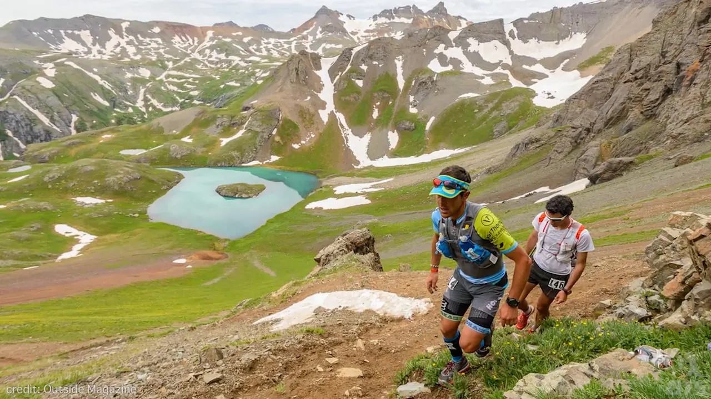
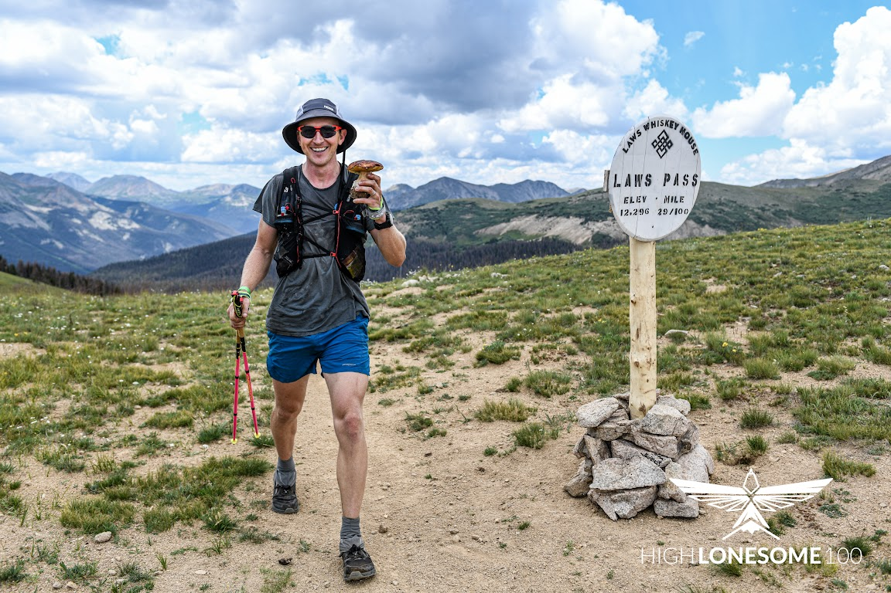

I’ve been working to get into the Hardrock 100 since 2013, and finally made it through the lottery this past December. The race starts on July 14th, this coming Friday! In three days, at 6am, I’ll jog out of Silverton, CO and begin a potentially 48 hour-long meditation on the phrase, “be careful what you wish for”.

For anyone interested in following along, here are the relevant links:

- [Runner tracking on OpenSplitTime](https://www.opensplittime.org/events/hardrock-100-2023/spread)
- [My live-tracking splits and estimates](https://www.opensplittime.org/efforts/hardrock-100-2023-sam-ritchie)
- [Live race coverage by RunSteepGetHigh](https://www.youtube.com/watch?v=ajPP4nig5Tc)

The course starts in Silverton and travels counter-clockwise through Lake City, Ouray and Telluride before aiming us back at Silverton, accumulating just over 33,000 feet of vertical gain along the way, all through terrain like this:

pc: https://www.letsdothis.com/us/e/hardrock-100-32807I first read about the Hardrock during a late night session in college Googling “hardest ultra events” across all sorts of disciplines. Back in 2008 I fully believed that it was impossible for me to finish an event like Hardrock or the Leadville 100! I raced two Ironman races, then spent my Golden Years from 2010 to 2012 focusing on the oddball combo of CrossFit and [ultra-distance canoe racing](https://www.texaswatersafari.org/).

Our Texas Water Safari crew imploded from lack of training in 2013 and I impulse-signed up for the Leadville 100 with six weeks to go and almost zero running under my belt over the previous three years.

I finished ([race report here](https://samritchie.io/leadville-trail-100)) after 26 hours of swollen hands, many pukes, 12 pounds lost and gained, extreme salt deprivation and almost two hours lying at the halfway point looking so bad that my mom wouldn’t speak to me for fear she’d burst into tears.

This finish got me a ticket in the Hardrock 2014 lottery. I didn’t make it, with < 1% odds.

The next year I raced Leadville again, with really no issues and a [more boring race report](https://samritchie.io/leadville-trail-100-2014-edition/?ref=samritchie.io) to show for it. Another Hardrock application, another fail. But Jenna and I paced Betsy Kalmeyer for a combined 50 miles of the 2014 Hardrock, and fell in love with the course and with Telluride. Buyer beware!!

In 2015 I hired Adam St. Pierre to coach me and ran and skied like a maniac, building up reserves of fitness that I am still leaning on today. I finished 9th at the Miwok 100k ([race report here!](https://samritchie.io/2015-miwok-100k-race-report/)) and 8th overall at the [Vermont 100m](https://vermont100.com/) in 18:08, definitely the fastest I’ll ever run this distance. This race wasn’t a Hardrock qualifier, but very special as my grandparents saw me at most of the aid stations. (Pop laid down a good accidental burn with “so how long does it take to run 100 miles? 15 hours?”)

In 2016 I had to run another qualifier to stay in the lottery, and chose the IMTUF 100 out in Idaho. This is my favorite race I’ve run so far, despite its surprise 109 mile distance. I finished 2nd overall ([race report here!](https://samritchie.io/imtuf-100-2016-race-report/?ref=samritchie.io)), and was *so* excited for my first podium picture… but the hardcore race director shamed me with a comment like “you guys don’t need some lame finish photo on the stands, right?”, so obviously no picture for me.

At this point I was getting a bit sick of these huge races and switched to the 125 mile “graduate level!!” Vapor Trail 125 mountain bike race for 2017 ([race report here](https://samritchie.io/vapor-trail-125-2017-race-report/))… in 2018 Jason Antin brought me back into trail running for the Rainier Infinity Loop and the [Tahoe 200](https://www.samritchie.io/tahoe-200-2018-race-report/). The race director’s “I don’t give a fuck!” attitude was frightening, but made for what I consider [my finest race report yet](https://www.samritchie.io/tahoe-200-2018-race-report). Seriously, go read this one, and don’t ever run a 200!

With the pandemic and a Hardrock cancellation in 2019 I didn’t need another qualifier until 2021. I raced the High Lonesome 100 and had an unexpectedly solid performance, coming in 4th overall in 23:52. I also completed my first successful mushroom foraging session with a haul of porcini a few miles before the 50k aid station:

And now here I am in 2023. Jenna and I had twins (Remi and Tilda) in May of 2022, and I spent most of my slim athletic time allotment lifting weights, reading about amateur Strongman competitions and avoiding the trails. Spring rolled around, the snow melted, I started running and the fear of The Big One has been slowly settling over me for the past four months.

I have an awesome crew with Jenna, Anna Frost, Dave Petrovics, Patrick Mckeon and Jeff Friesen, plus my parents coming in to town to watch the babies while I flail around the mountains. I have no idea what to expect. I’m leaning on a history of mostly-successful race day execution, and my belief that the wheels fall off in these things from thinking too much and skipping salt pills.

Please [follow along on the tracking page](https://www.opensplittime.org/efforts/hardrock-100-2023-sam-ritchie) over the weekend, and wish me luck!

If you’re looking for something to read, check out [John L. Parker’s "Once a Runner"](https://amzn.to/44GOb6u), from [my “5 books for endurance addicts” post](https://samritchie.io/5-books-for-endurance-addicts/).

If you want to get the sense of one of these races, you *have *to watch “Unbreakable”, about the 2010 Western States Endurance Run. [It’s buy-only but totally worth it](http://www.ws100film.com/).

I also highly recommend “[Where Dreams Go to Die](https://www.youtube.com/watch?v=NDZdsqbcGTU)”, Ethan Newberry’s documentary about the much-crazier Barkley Marathons.

See you all sometime next week with a race report!
