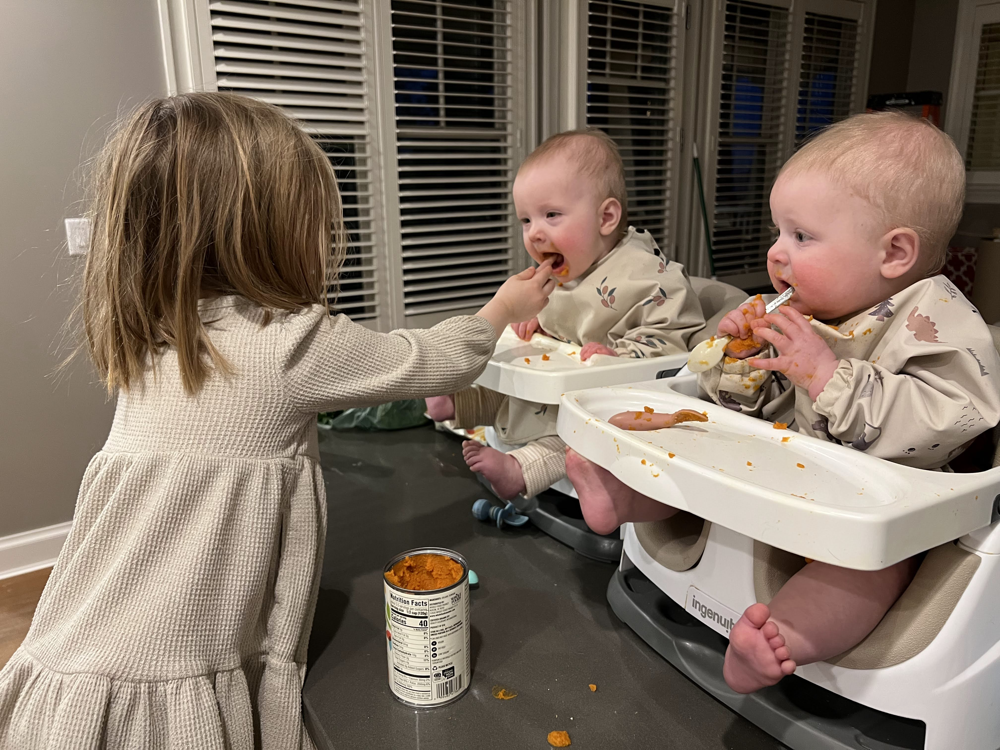
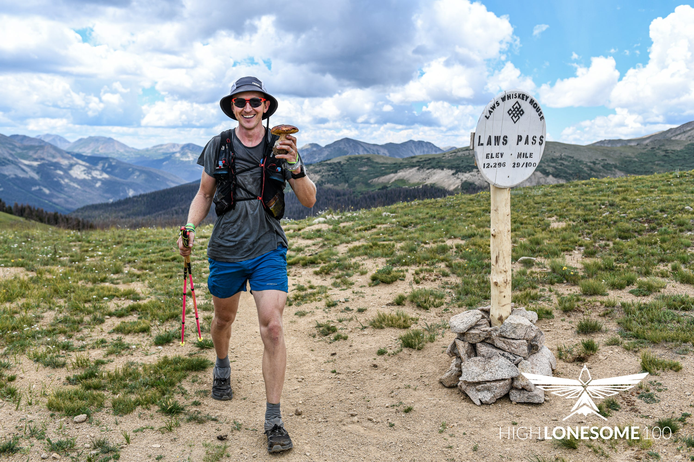

Wait long enough to write and the updates are bound to be interesting! I’ve gone through many lives since I last wrote, back in July of 2020, mid-pandemic.

### Leaving Google for… Computer Algebra?

I quit my job at Google at the end of 2021. I’m not sure I ever wrote about starting this job back in 2019. Yes, for about 15 months I was a *Staff Research Engineer *at *Google X, *a dream job on paper! In reality, fairly pedestrian and factory-like.

The team I joined was a group of (ex?-)physicists who had convinced Sergey Brin to fund a small autonomous lab with a pure research goal: use the mathematical tools of physics to try and develop a *science* of [deep learning](https://www.fast.ai), supplanting the industry’s bag of tricks with deep principles. Most research in neural networks and deep learning today seems to be about finding odd little tricks to beat some arbitrary performance benchmark by truly minuscule amounts. (Often these benchmarks are things like correctly classifying large sets of images hand-selected by grad students decades ago.)

This team was going to be different! There would be no pressure to publish “incremental” papers, or chase performance reviews; just a bold, targeted foray into the frontier! Researchers would “set their own research agenda”.

I decided to pretend that this was an honest, straightforward deal. I did some good worker-bee projects, and built and open-sourced [Caliban](https://github.com/google/caliban), even receiving personal feedback from Sergey Brin (“Sounds like the *Taliban, *don’t you think?” to which a colleague deadpanned, “V2’s working name is ISIS... problem?”) But I also let myself grow obsessed with how poor the experience of performing research, and publishing research artifacts, seemed to be, even at Google in the 21st century. Literally no one I spoke to at Google had a structured lab notebook for the computing investigations we were performing, and the Google organization was actively hostile to external software like [Roam Research](https://roamresearch.com), always for “security reasons”. It was wild to see employees attempting to rebuild products like Roam or Obsidian inside Google, just so they could track their work.

“[Where are the Humane Microworlds?](https://roadtoreality.substack.com/p/where-are-the-humane-microworlds)” and “[The Dynamic Notebook](https://roadtoreality.substack.com/p/the-dynamic-notebook)” are two essays I wrote, early in my obsession.

I’ll write more soon on where this work is now, and on the details of what I was building and producing each day. But I’ll say now that I had never felt more energized, excited and productive. I couldn’t believe this was a *job!*

The work grew far enough afield from “Science of Deep Learning” that, even with the cover of “researchers set their own agenda”, my boss attempted to bring me into line by having me perform the reasonable steps of putting together a “product plan” with “milestones”. I struggled with this for a few months before [Brad Feld](https://feld.com/) convinced me to quit and work on this thing full-time, with generous support from him. (The line he used was, “Google is an amazing place to work… as long as you’re comfortable with the fact that they own your brain.“ Buy a copy of [Disciplined Minds](https://amzn.to/2WE3wqH) for more detail on brain ownership.)

My work since then has centered on a computer algebra system named [Emmy](https://github.com/mentat-collective/emmy), formerly called [SICMUtils](https://github.com/sicmutils/sicmutils). Think of this as an engine that will let me write blog posts, research papers or entire textbooks that are actually executable programs, with the code that generated each figure or diagram embedded in the book itself. As you’re reading about some physics example exploring the [principle of least time](https://samritchie.io/optics-and-the-principle-of-least-time/), you’ll be able to run your own little physics experiments by tweaking the specific numbers that power the figure. Everything runs in a browser, and it’s built in such a way that it *should* be possible to read these executable texts online with other people — [Mathematica](https://www.wolfram.com/mathematica/) meets Google Docs meets multiplayer gaming.

I’m not sure why I feel so strongly that something like this should exist. I can’t see any money in the project, certainly not the way that I’ve been going about it, and the project description tends to summon equal measures of confusion and sympathy from anyone outside of the tech world that asks me what I do for work.

My fire got lit and I’ve decided not to think too rationally about what it all meant. I have a simmering fear that these excited phases are rare and uncommon, and that if I don’t respect them when they come I’ll lose the ability to recognize them in the first place.

I’ve been battling for months with the more difficult-for-me 2D and 3D visualization parts of the project, but I’m through the thickets and should have some more polished work to share soon.

I’ll be speaking at the [Clojure Conj](https://2023.clojure-conj.org/) on Friday, April 28th about this work. Earlier that week I’ll be in Boston giving a talk to Gerald Sussman’s [“Adventures in Advanced Symbolic Programming”](https://groups.csail.mit.edu/mac/users/gjs/6.945/index.html) course. This is a major life accomplishment for me and closes the circle of this whole project. There really is so much more to tell about the people involved in this quixotic past few years! All in good time.

### Personal Updates

My most extreme personal update is that I’m now a father of 10 month old twins! Here’s a photo of 4-year-old Juno feeding Tilda and Remi Ritchie:

Before the twins were born I managed to get the airplane project to the hangar and push it to probably 98% completion. I’ve stalled out again, but plan on switching the majority of my time to airplane building after my April talk and getting N720AK into the air.

I raced the High Lonesome 100 in July of 2021 and pulled off fourth place overall. Here’s a shot of one of the Porcini mushrooms I foraged during the race:

I spent the fall training like a maniac for the [HURT 100](https://hurt100.com) under the guidance of [Jason Koop](https://www.jasonkoop.com), and then bailed a month before the January 2022 race to spend more time on other elements of my life before the twins arrived in May. This past week I’ve revived that training plan, as I’ve finally made it into the [Hardrock 100](https://hardrock100.com/). I’ve been applying for the Hardrock Lottery since 2014, and my ticket count finally grew prosperous enough to force the issue.

I’m going to attempt to pad out Hardrock into a version of the “Colorado Triple”. The plan is:

- Pull a 2.5x bodyweight deadlift (430# at my current weight) at 6pm the evening before the race
- Drive to the start line at Silverton and climb a 5.12 route in Ouray on the way
- Start the Hardrock the next morning at 6am and see what happens.

Anything else? Oh, I started playing the violin just after the High Lonesome in 2021 and have put bow to strings every day since. The pattern here is that I’ve checked many random boxes, but that I’ve lost a defining story for everything going on in my life. I’m off in strange waters, doubting myself creatively a bit, and hoping for another motivational swell to lift me off of the shoals.

My next phase is going to involve quite a bit of teaching, sharing and writing, on this newsletter and [Road to Reality](https://roadtoreality.substack.com/publish).

We’re roughly up to speed, so I’ll call it for now. Please write and let me know what you find exciting these days. I’d especially love to hear from anyone that’s found an intellectual community, like a book club, study group, that sort of thing that feels like it’s really energized you and is self-sustaining.

Onward!

Thanks for reading! If this email was forwarded to you, subscribe for free to receive new posts and support my work.
